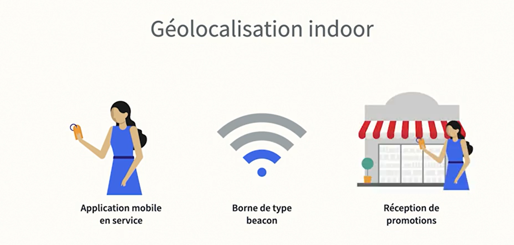
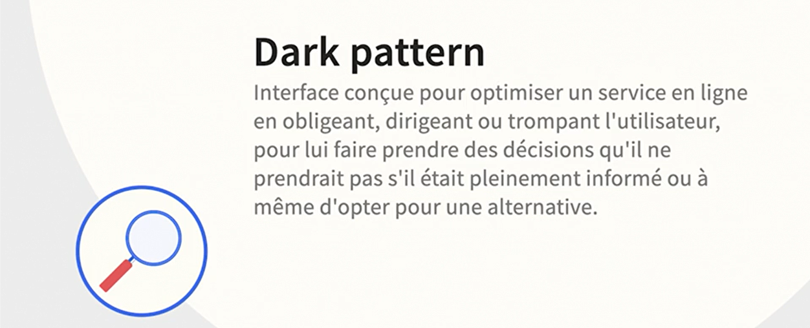
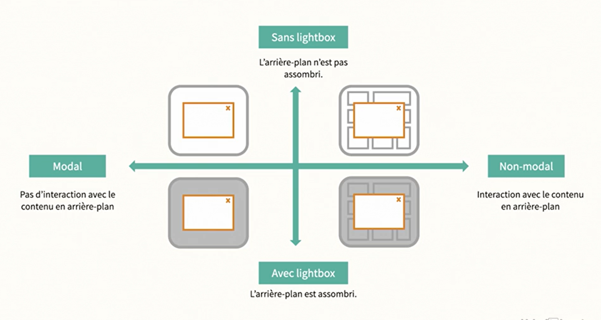

# L'UX pour le design web

Dans cette formation de Didier Mazier, vous apprendrez à améliorer et à optimiser l'expérience utilisateur (UX, User eXperience) de votre site web commercial. Après avoir abordé les principes de base, vous étudierez et vous tiendrez compte du comportement des utilisateurs ainsi que de leur parcours lors de leurs visites. Vous verrez comment soigner et optimiser la structure, la navigation, le design et l'aspect du site et de ses contenus texte et graphique. Enfin, vous vous pencherez sur un autre aspect important de l'UX, à savoir les techniques d'acquisition et de fidélisation des clients.

## Le Programme De Ce Cours
### Depasser Les Aspects suivants 

### Les Principes Aborder Dans Ce Cours

### Application Des Pratiques

### Approche Centré Produit VS Utilisateur

### Optimiser La Structure Et La Navigation

### Vérifier Les Points Clés

## Distinguer UI Et UX

### Qu'est L'UI

### Qu'est L'UX

### Les Axes de L'UX

## Objectif de UX
### Les Objectifs Des Sites

### Les Objectifs De L'Utilisateur

### Scénario: Les Bases
Pour repondre à un problème d'UX, nous devons segmenter le travail (Qui ?, Pourquoi?, Comment ?) et repondre à ces questions:
1. Qui sont nos utilisateurs ?
2. Pourquoi viennent-ils sur notre site et quel est le problème qu'ils veulent répondre ?
3. Comment vont-ils se comporter sur notre site ou à l'exterieur de notre site(réseaux, ....), quelle fréquence, quel va être leurs modes de visite ?
4. C'est ainsi que nous allons pouvoir faire émerger les objectifs de nos utilisateurs
   

## Intégrer UX Dans Un Projet Web
### Problématique
la création d'un site web fait  face à des problèmes reccurents et souvent répétitifs

### Solution
La création d'un site web fait intervenir une équipe pluridisciplinaire, donc le rôle de l'UX va être l'intégration des diffrentes compétences avec une approche centré sur les bésoins de utilisateur.

L'UX va également faire travailler les différentes équipes en parallèle pour éviter les effets de silo

### illustration

### Avantages

## Conduire Des Tests
On mesure les aspects suivants:
1. le nombre de succès d'utilisation du produit
2. le nombre d'echecs d'utilisation du produit
3. le taux d'erreur
4. la facilité d'utilisation
   

### Type de tests
Nous allons faire nos tests sur les éléments suivants:
1. le contenu
2. la forme
3. le parcours

Il y a également ce genre de test

### Conduite De Tests

### Organisation Des Tests

## Prototyper Sur Papier
### Trier De Carte

### Prototype Sur Papier

## Logiciel de Prototypage

## Comprendre Le Comportement Utilisateur
### Etudes

### Statistique

### Persona
Pour bien comprendre nos utilisateurs, il va falloir créer des persona:
c'est à dire des profiles de segments significatifs
1. Socio-démographiques 
    * l'âge
    * niveau d'études
    * profession
    * situation familiale
    * l'habitat...
2. Comportementales
    * quelles sont les motivations
    * quelles sont les attentes
    * quel est le niveau technologique de notre cible
    * comment il va s'exprimer avec quel langage
3. Problème
    * quels sont ses objectifs
    * quelles sont ses frustrations
4. Points de contact
    * où nous allons entrer en contact avec ce persona
    * quels sont les media qu'il semble fréquenter
    * quels sont les réseaux sociaux qu'il fréquence le plus souvent
    * quelle est appartenance à des groupes (réligieux, politique, raciale, ....) 

###  Vision Claire

### Organisation Du Processus

## Concevoir Pour Toutes Les Générations

### Analyse Générationnelle
1. Technique/physiques liées à l'âge
   * la baisse de la vision
   * la baisse de la mobilité, 
   * ...
2. Sociétales
   * quel est le status professionel(actif ou retraiter)
   * le genre
   * l'habitat
   * l'éducation
   * ...
3. Générationnelles
   * quels sont les modes de pensés et d'actions communes à un groupe d'âge liées la position dans le temps de la génération à quelle va appartenir l'individu.

### Génération

### Plages Des Générations

## Comprendre Les Attentes Des Générations Boomers

## Comprendre Les Attentes Des Générations X

## Comprendre Les Attentes Des Générations Milléniaux

## Comprendre Les Attentes Des Générations Z

## Comprendre Les Attentes Des Générations Alpha

## Les points De Contact

## Appréhender Le Parcours Utilisateur
### Le Parcours Client

### Les Etapes Du Parcours Client

### Les Stratégies A Mettre en place

### La Carte d'Expérience

## Distingguer Le Parcours Et Séquences

### Parcours Pour L'Utilisateur

### Penser <<Séquences>>

### Options Claires

### Micromoment

### Engager Les Clients Au Micromoment

## Employer La Persuasion Et Les Dark Patterns
### Définition du Dark Pattern

### Notion De Zone Grise

### Où Placer La Limite ?

### Critères de Persuasion
On doit se baser sur les critères suivants pour trancher avant de proceder à la persuation 

## Guider L'Utilisateur

### Onboarding

### Pour Réussir Onboarding

### Guider Un Utilisateur Quand

### Où Et Comment Guider L'Utilisateur

### Apprentissage Et Intuitivité

## Solution Guider Utilisateur

## Soigner Les Interactions
### Etablir Des Ponts

### Penser <<Multicanal>>

## Comment Employer Les Modals

### Avant L'Accès Au Contenu

### Conditionner L'Accès 

### Susciter Le Feedback

### Promotion 

## Comprendre Les Causes De Rebond

### Insatisfaction

### Cause D'Insatisfaction

### Autres Causes
1. Une navigation trop complexe basée sur l'organisation de l'entreprise, soit sur son catalogue
   
2. Une navigagiton éparpillé avec des menu un peu partout
   
3. Une arborescence atomisée c'est à dire qui va diviser la navigation dans un souci d'organisation
   

4. Des média intrusifs qui vont s'introduire automatique vont perturber l'utilisateur et cela va interrompre son cheminement et finalement, il va quitter votre site
   
5. La présence des barrières qu'on appelle en développement web getting qui permet d'obtenir des informations sur les utilisateurs en échange de contenu c'est quelque chose qui donne une mauvaise réputation
   
6. La mauvaise lisibilité comme l'usage de plusieurs couleurs, petite taille de police, ...
   

## Gérer Les Preuves Sociales
### Le Bouche A Oreille

### Réduire L'Incertitude

### Réseaux Sociaux (Arme A Double Tranchant)

### Montrer Les Meilleures Ventes

### Cross-selling: Vente Croisée

### Up-selling: Montée En Gamme

### Temoignage Sur Les Leading Pages

## Optimiser L'Accessibilité
