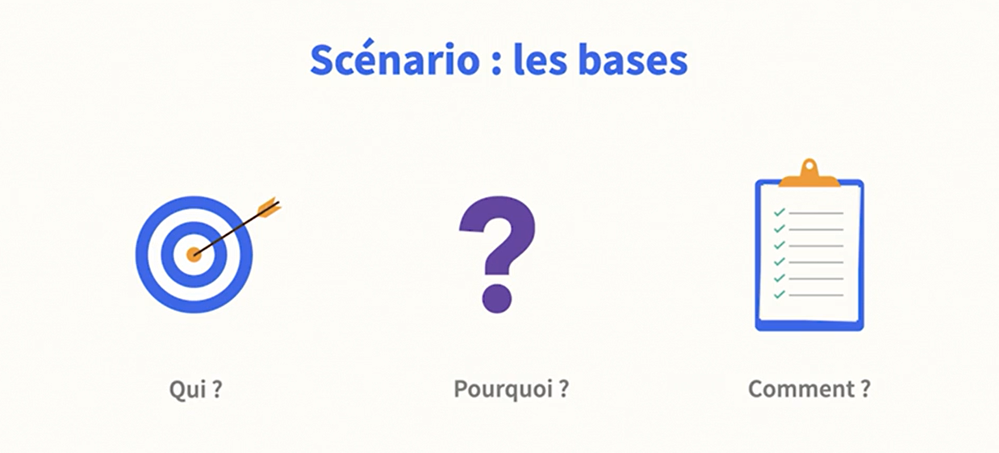
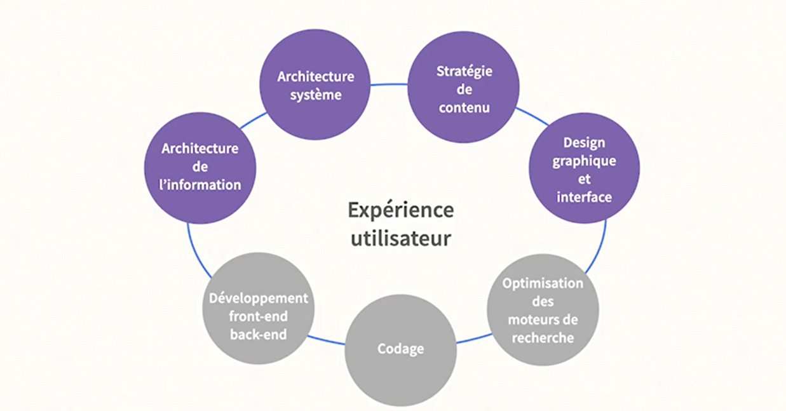
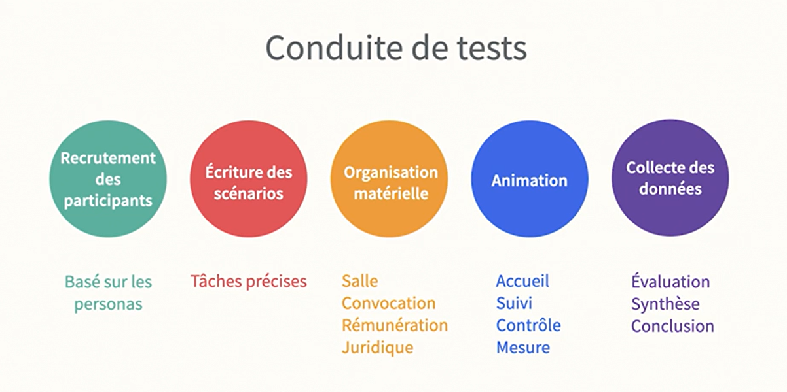

# L'UX pour le design web

Dans cette formation de Didier Mazier, vous apprendrez à améliorer et à optimiser l'expérience utilisateur (UX, User eXperience) de votre site web commercial. Après avoir abordé les principes de base, vous étudierez et vous tiendrez compte du comportement des utilisateurs ainsi que de leur parcours lors de leurs visites. Vous verrez comment soigner et optimiser la structure, la navigation, le design et l'aspect du site et de ses contenus texte et graphique. Enfin, vous vous pencherez sur un autre aspect important de l'UX, à savoir les techniques d'acquisition et de fidélisation des clients.

## Le Programme De Ce Cours
### Depasser Les Aspects suivants 

### Les Principes Aborder Dans Ce Cours

### Application Des Pratiques

### Approche Centré Produit VS Utilisateur

### Optimiser La Structure Et La Navigation

### Vérifier Les Points Clés

## Distinguer UI Et UX

### Qu'est L'UI

### Qu'est L'UX

### Les Axes de L'UX

## Objectif de UX
### Les Objectifs Des Sites

### Les Objectifs De L'Utilisateur

### Scénario: Les Bases
Pour repondre à un problème d'UX, nous devons segmenter le travail (Qui ?, Pourquoi?, Comment ?) et repondre à ces questions:
1. Qui sont nos utilisateurs ?
2. Pourquoi viennent-ils sur notre site et quel est le problème qu'ils veulent répondre ?
3. Comment vont-ils se comporter sur notre site ou à l'exterieur de notre site(réseaux, ....), quelle fréquence, quel va être leurs modes de visite ?
4. C'est ainsi que nous allons pouvoir faire émerger les objectifs de nos utilisateurs
   

## Intégrer UX Dans Un Projet Web
### Problématique
la création d'un site web fait  face à des problèmes reccurents et souvent répétitifs

### Solution
La création d'un site web fait intervenir une équipe pluridisciplinaire, donc le rôle de l'UX va être l'intégration des diffrentes compétences avec une approche centré sur les bésoins de utilisateur.

L'UX va également faire travailler les différentes équipes en parallèle pour éviter les effets de silo

### illustration

### Avantages

## Conduire Des Tests
On mesure les aspects suivants:
1. le nombre de succès d'utilisation du produit
2. le nombre d'echecs d'utilisation du produit
3. le taux d'erreur
4. la facilité d'utilisation
   

### Type de tests
Nous allons faire nos tests sur les éléments suivants:
1. le contenu
2. la forme
3. le parcours

Il y a également ce genre de test

### Conduite De Tests

### Organisation Des Tests

## Prototyper Sur Papier
### Trier De Carte

### Prototype Sur Papier

## Logiciel de Prototypage

## Comprendre Le Comportement Utilisateur
### Etudes

### Statistique

### Persona
Pour bien comprendre nos utilisateurs, il va falloir créer des persona:
c'est à dire des profiles de segments significatifs
1. Socio-démographiques 
    * l'âge
    * niveau d'études
    * profession
    * situation familiale
    * l'habitat...
2. Comportementales
    * quelles sont les motivations
    * quelles sont les attentes
    * quel est le niveau technologique de notre cible
    * comment il va s'exprimer avec quel langage
3. Problème
    * quels sont ses objectifs
    * quelles sont ses frustrations
4. Points de contact
    * où nous allons entrer en contact avec ce persona
    * quels sont les media qu'il semble fréquenter
    * quels sont les réseaux sociaux qu'il fréquence le plus souvent
    * quelle est appartenance à des groupes (réligieux, politique, raciale, ....) 

###  Vision Claire

### Organisation Du Processus
